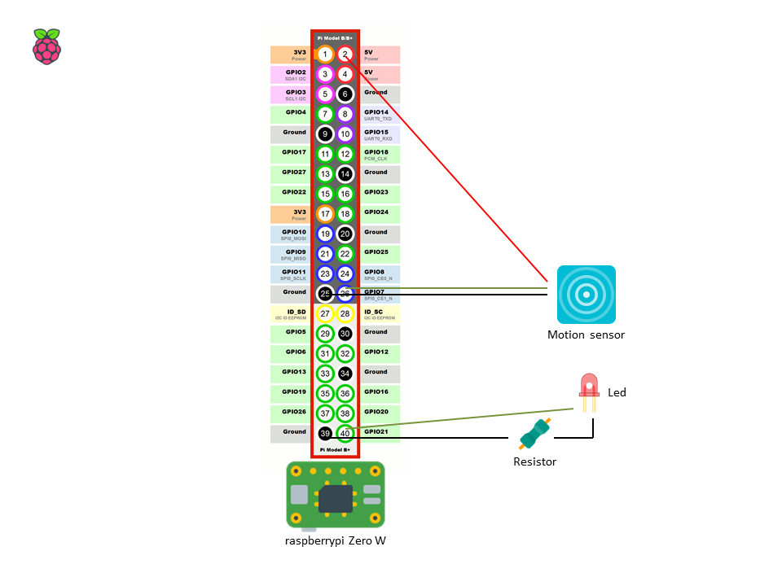

In this project i created a simple circuit with an RaspberryPi Zero and motion sensor that can detect movement. An LED will light up when movement is detected.

## Shema

## Install motion sensor
- Follow step by step
    - 1) https://www.raspberrypi.org/documentation/installation/noobs.md
    - 2) raspi-config (active ssh), apt-get update && apt-get dist-upgrade -y
    - 3) modify /etc/dhcpcd.conf (only if you want a static ip address)
    - 6) copy motionsensor.py => /home/pi/
    - 7) install the raspberry pi zero simple circuit (schema example)
    - 8) run script : python /home/pi/motionsensor.py
    - 9) enjoy !
